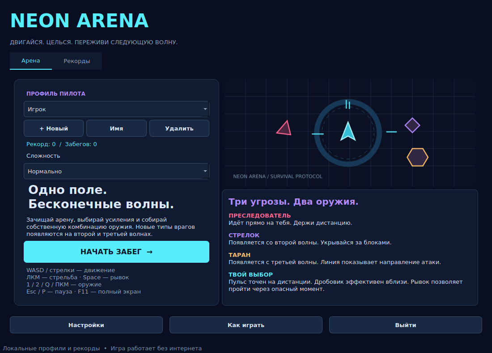
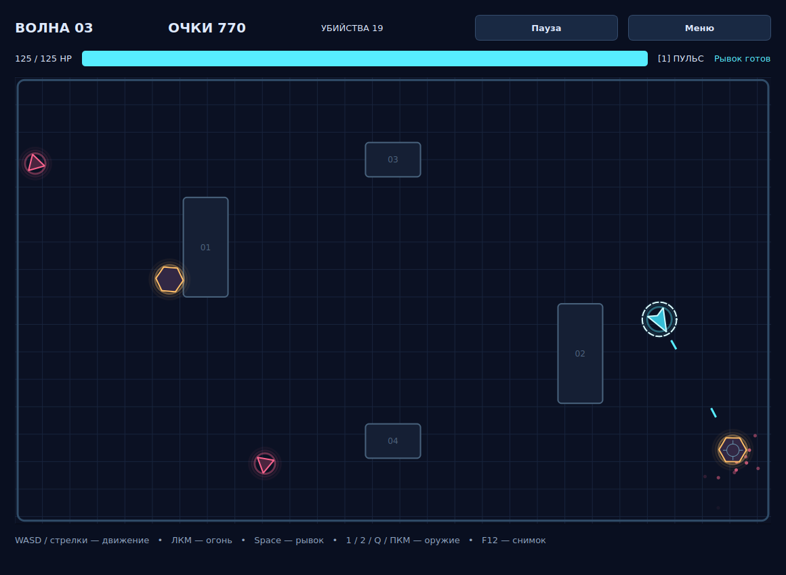

# Neon Arena

Аркадная игра на **Python, PyQt6 и SQLite**: движение по арене, стрельба мышью,
волны противников, рывок, выбор усилений и таблица рекордов. Игровая симуляция
отделена от Qt, графика отрисовывается через QPainter, интерфейс загружается из
пяти `.ui` форм Qt Designer.



## Запуск

Нужен 64-битный Python 3.11–3.13 и рабочий стол. Проверенная среда: Python 3.12.14,
PyQt6 6.11.0, Qt 6.11.2, Linux x86_64, Qt offscreen. Интернет требуется для
первой установки библиотек; сама игра полностью локальная.

**На Windows:** распакуй весь архив, открой папку `NeonArena`, запусти
`start_windows.bat`. Скрипт создаст `.venv`, установит библиотеки и откроет меню.
Нужен Python Launcher (`py`), устанавливаемый вместе с Python.

**Вручную на Windows:**

```powershell
py -3 -m venv .venv
.venv\Scripts\python.exe -m pip install -r requirements.txt
.venv\Scripts\python.exe main.py
```

**Linux / macOS:**

```bash
python3 -m venv .venv
.venv/bin/python -m pip install -r requirements.txt
.venv/bin/python main.py
```

Команды выполняются из папки с `main.py`. Qt Designer для запуска не нужен.
Если на Linux появляется ошибка плагина `xcb`, установи системные зависимости
Qt для своего дистрибутива; одна из типичных зависимостей — `libxcb-cursor0`.

## Как играть

1. Выбери профиль или создай свой. Выбери сложность и нажми «Начать забег».
2. Двигайся, удерживай левую кнопку мыши для стрельбы и следи за здоровьем.
3. Используй препятствия как укрытия: они останавливают врагов и снаряды.
4. Переключай оружие. Пульсовый бластер точен на расстоянии, дробовик выпускает
   несколько снарядов за выстрел и эффективнее вблизи.
5. Нажимай Space для короткого быстрого рывка с временной защитой от урона.
6. Уничтожь всех врагов волны и выбери одно из трёх предложенных усилений.
7. При поражении откроется результат. Можно сразу начать заново или вернуться
   в меню, где результат появится в таблице рекордов.



Скриншот арены получен из реального игрового движка при автоматическом прохождении
с защищённым от урона ботом. В обычной игре такой защиты у игрока нет: только
короткая неуязвимость после попадания или рывка.

### Управление

| Действие | Управление |
|---|---|
| Движение | WASD или стрелки |
| Прицеливание | Мышь |
| Стрельба | Удерживать ЛКМ |
| Пульсовый бластер | 1 |
| Дробовик | 2 |
| Переключение оружия | Q или ПКМ |
| Рывок | Space; по движению, а без движения — к прицелу |
| Пауза / продолжение | Esc, P или кнопка «Пауза» |
| Полный экран | F11 |
| Сохранить снимок игры | F12, затем стандартный диалог выбора файла |
| Выбор усиления | Кнопки или клавиши 1, 2, 3 |

При потере фокуса игра автоматически ставится на паузу и сбрасывает удерживаемые
клавиши и кнопку стрельбы. После возвращения нажми Esc/P, чтобы продолжить.
Время паузы и выбора улучшения не входит во время забега.

### Противники

| Тип | Появление | Поведение |
|---|---|---|
| Преследователь, розовый треугольник | С волны 1 | Приближается и наносит контактный урон |
| Стрелок, фиолетовый ромб | С волны 2 | Держит дистанцию, отступает при сближении, стреляет |
| Таран, жёлтый шестиугольник | С волны 3 | Сначала показывает линию атаки, затем делает рывок |

В первой волне 7 врагов. С каждой волной их количество растёт до 28;
здоровье врагов увеличивается, а скорость ограничена верхним коэффициентом.
Волны бесконечны; финального босса и сюжетного конца в этой версии нет.

### Улучшения

После каждой зачистки случайно выбираются три разных варианта из восьми:

| Улучшение | Эффект |
|---|---|
| Усилитель | +25% урона |
| Разгон | Интервал выстрелов умножается на 0.85 |
| Ускоритель | +12% скорости |
| Броня | +25 к максимуму здоровья и +25 HP |
| Ремкомплект | Лечение на 50 HP, до максимума |
| Импульс | Перезарядка рывка умножается на 0.8 |
| Пробой | Пульсовый снаряд пробивает ещё одного врага |
| Картечь | +2 снаряда дробовика |

Есть ограничения на скорость, частоту огня, перезарядку рывка, пробивание и
число дробинок. Окно улучшений требует выбора либо завершения забега:
закрыть его через Esc и пропустить усиление нельзя.

## Профили и результаты

В меню доступны создание, переименование и удаление профилей.
Имя — от 1 до 24 символов; одинаковые имена без учёта регистра запрещены.
Удаление профиля требует подтверждения и удаляет связанные забеги.

Завершённый поражением забег участвует в рекордах. Выход через кнопку «Меню»
сохраняет забег как **прерванный**: он не увеличивает личный рекорд, но остаётся
в истории. Во вкладке «Рекорды» можно фильтровать сложность, показывать свои
забеги и включать прерванные. Показываются до 100 лучших записей по фильтру.
Экспорт CSV сохраняет текущую отфильтрованную таблицу.

Очки начисляются за уничтоженных врагов и зачистку волны; сложность влияет на
очки, урон и характеристики врагов. Для сравнения результатов используй фильтр
сложности. Личный рекорд профиля — максимальный результат среди всех сложностей.

## Техническое задание

Разработать настольную аркадную игру на PyQt с игровым циклом, обработкой событий,
мультимедиа и постоянным хранением профилей. Основные функции:

1. Движение игрока, стрельба, смена оружия, рывок, препятствия и столкновения.
2. Три типа противников, поэтапный спавн, рост сложности волн.
3. Выбор улучшений после зачистки и отображение итогов забега.
4. Пауза, полноэкранный режим, настройки звука и эффектов.
5. SQLite: чтение профилей и результатов, запись забегов, изменение статистики.
6. Формы Qt Designer, стандартные диалоги, клавиатура и мышь.
7. Документация, отчёт, возможность сборки Windows standalone.

### Соответствие заданию Qt

| Требование | Реализация |
|---|---|
| Классы и модули, не менее 500 строк | World, Player, Enemy, Projectile, ArenaCanvas, Repository, Audio, классы окон и диалогов |
| Не менее двух форм Qt Designer | `menu.ui`, `game.ui`, `settings.ui`, `upgrade.ui`, `result.ui` |
| Не менее пяти видов виджетов | QLabel, QPushButton, QComboBox, QTabWidget, QTextBrowser, QTableWidget, QCheckBox, QSlider, QProgressBar |
| Стандартные диалоги | QInputDialog, QMessageBox, QFileDialog |
| Мультимедиа | Векторная графика, SVG заставка и 6 WAV эффектов через QSoundEffect |
| БД минимум из двух таблиц | players, runs, settings |
| Чтение, запись и изменение | SELECT, INSERT, UPDATE; изменение имён, настроек и статистики |
| Клавиатура | keyPressEvent, keyReleaseEvent, QShortcut |
| Мышь | mouseMoveEvent, mousePressEvent, mouseReleaseEvent, сигналы кнопок |
| requirements.txt и readme.md | В корне проекта |
| Отчёт | `docs/NeonArena_report.docx` |
| Windows .exe | spec, BAT и GitHub Actions для сборки на Windows |

Формы имеют формат Qt Designer и открываются для визуального редактирования
в Qt Designer / Qt Creator. Окно игры содержит контейнер `arenaHost`;
программно в него добавляется `ArenaCanvas`. Анимация и игровая графика
рисуются в этом виджете; структура остальных экранов находится в `.ui`.

## Архитектура

| Модуль | Назначение |
|---|---|
| `main.py` | QApplication, оформление, обработка ошибок, проверочный запуск |
| `neonarena/engine.py` | Модель игрового мира, движение, бой, волны и улучшения; без Qt |
| `neonarena/canvas.py` | Отрисовка QPainter, преобразование координат и ввод |
| `neonarena/windows.py` | Формы, игровой цикл, навигация и диалоги |
| `neonarena/storage.py` | SQLite, профили, статистика, настройки, пути |
| `neonarena/audio.py` | Звуковые эффекты QSoundEffect |
| `neonarena/theme.py` | Общий Qt Style Sheet |
| `ui/` | Пять форм Qt Designer |
| `assets/` | SVG заставка и WAV эффекты |
| `tests/` | Проверки симуляции, базы и Qt интерфейса |
| `docs/` | Отчёт, проверка, скриншоты, сценарий защиты |

QTimer обновляет экран примерно раз в 16 мс. QElapsedTimer измеряет прошедшее
время. Симуляция выполняется с фиксированным шагом 1/120 секунды через
накопитель времени, поэтому движение не зависит напрямую от частоты отрисовки.
Длительная задержка ограничивается 0.1 секунды, чтобы приложение не пыталось
догонять пропущенные минуты после остановки процесса.

Снаряды проверяются на столкновение вдоль пройденного за шаг отрезка;
это предотвращает пролёт быстрых снарядов через противника. Геометрия игроков
и препятствий обрабатывается отдельно от визуального представления.
Пробивающий снаряд помнит ID уже поражённых целей.

### База данных и сохранение

- `players`: имя, нормализованное имя, рекорд, количество забегов и убийств.
- `runs`: UUID забега, внешний ключ игрока, очки, волна, убийства, время,
  сложность, признак завершения, улучшения и дата.
- `settings`: настройки в виде JSON значений по ключу.

Сохранение результата и изменение статистики профиля выполняются в одной
транзакции. Уникальный UUID предотвращает повторную запись одного забега.
Включены внешние ключи и каскадное удаление. SQL использует параметры.

`neon-arena.sqlite3` и журнал ошибок находятся в `QStandardPaths.AppLocalDataLocation`.
Обычно Windows использует `%LOCALAPPDATA%\NeonArena\NeonArena`.
Чтобы указать другой каталог, задай переменную `NEONARENA_DATA_DIR`.
Для переноса результатов закрой игру и скопируй SQLite файл.
Если удалить все профили, игра предложит создать новый; первый профиль
не добавляется повторно при каждом запуске.

Рекорды сохраняются при штатном завершении забега. Текущий бой не восстанавливается
после принудительного завершения процесса или отключения питания.
У игры нет сетевого режима и защиты от ручного редактирования локальной базы.

## Проверки

```bash
python -m pip install -r requirements-dev.txt
python -m ruff check .
python -m unittest discover -s tests -v
```

В GUI тестах автоматически установлен `QT_QPA_PLATFORM=offscreen`.
Выполнены 36 автоматических проверок: симуляция, разные атаки, столкновения,
пауза, волны, улучшения, профили, запись результата, клавиатура, мышь,
навигация, настройки, экспорт и преобразование координат.
Протокол проверки: `docs/verification.md`.

Для проверки комплектации после сборки есть аргумент `--smoke-test`.
Он открывает основные формы и завершается с кодом 0; этот режим следует
запускать с отдельным `NEONARENA_DATA_DIR`, чтобы не менять обычные данные.

## Standalone для Windows

В исходном архиве `.exe` нет. Его необходимо собрать на Windows.
Запусти `build_windows.bat` или в виртуальном окружении:

```powershell
python -m PyInstaller --noconfirm --clean NeonArena.spec
```

Получится `dist\NeonArena\NeonArena.exe` и папка `_internal`.
Передавать нужно **всю папку `dist\NeonArena`**; на целевом компьютере
Python не требуется. Не переноси один `.exe` отдельно от его ресурсов.

### GitHub Actions

Включён `.github/workflows/windows-build.yml`. После загрузки проекта в
репозиторий он собирает Windows standalone, выполняет тесты и проверяет
запуск упакованного приложения. Скачай артефакт **NeonArena-Windows**.

```bash
git init
git add .
git commit -m "Add Neon Arena game"
git branch -M main
git remote add origin https://github.com/YOUR_LOGIN/NeonArena.git
git push -u origin main
```

Замените YOUR_LOGIN своим логином. Репозиторий по этому примеру не был создан.
Workflow также можно запустить вручную через Actions → Windows standalone → Run workflow.
После успешной сборки проверь игру на целевом Windows: управление, звук,
полный экран, несколько волн, результат и сохранение после перезапуска.
Windows сборка в текущей Linux среде не выполнена и не проверена.

## Отчёт и защита

В `docs/NeonArena_report.docx` есть описание реализации и скриншоты. Перед
сдачей заполни ФИО, группу, учебное заведение и настоящие ссылки на репозиторий
и Windows сборку. `docs/defense.md` содержит сценарий демонстрации.

Технические источники:

- [PyQt6](https://www.riverbankcomputing.com/static/Docs/PyQt6/)
- [Qt Widgets и рисование](https://doc.qt.io/qt-6/qpainter.html)
- [Qt Multimedia](https://doc.qt.io/qt-6/qsoundeffect.html)
- [PyInstaller](https://pyinstaller.org/en/stable/)

Графика и WAV эффекты созданы для проекта. PyQt6 используется под GPLv3 либо
коммерческой лицензией Riverbank; сведения: https://www.riverbankcomputing.com/software/pyqt/.
